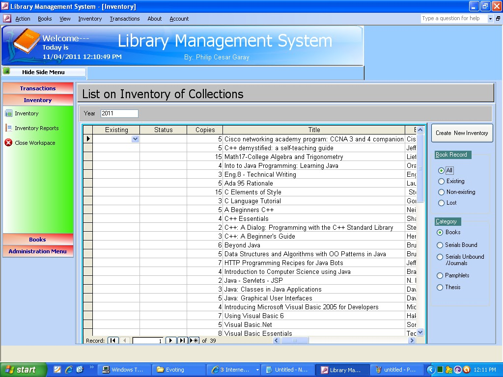



## Library Management System

### Description

This system is created to replace the manual lending, returning and inventory of books.

features..

* 2 user account administrator, able to use all system function while user, only for searching books..

*advance search function using SQL "LIKE"

*imposing penalties on due books...

*add/remove books

*classify books according to their category and class

*lost and replace books..

*hide system to system tray

*and many more....

For more information you can visit this site

<a href="http://www.sourcecodester.com/microsoft-access/library-management-system.html">Library Management System</a> and

<a href="http://jansoftsolutions.blogspot.com/2011/12/library-management-system.html">JANSoft Solutions</a>
 
### More Info
 

             |
---                |---
**Submitted On**   |2010-11-12 19:56:28
**By**             |[itachi\_philip](https://github.com/Planet-Source-Code/PSCIndex/blob/master/ByAuthor/itachi-philip.md)
**Level**          |Intermediate
**User Rating**    |4.8 (24 globes from 5 users)
**Compatibility**  |VB 6\.0, VBA MS Access
**Category**       |[Complete Applications](https://github.com/Planet-Source-Code/PSCIndex/blob/master/ByCategory/complete-applications__1-27.md)
**World**          |[Visual Basic](https://github.com/Planet-Source-Code/PSCIndex/blob/master/ByWorld/visual-basic.md)
**Archive File**   |[Library\_Ma22169012212011\.zip](https://github.com/Planet-Source-Code/itachi-philip-library-management-system__1-74223/archive/master.zip)

